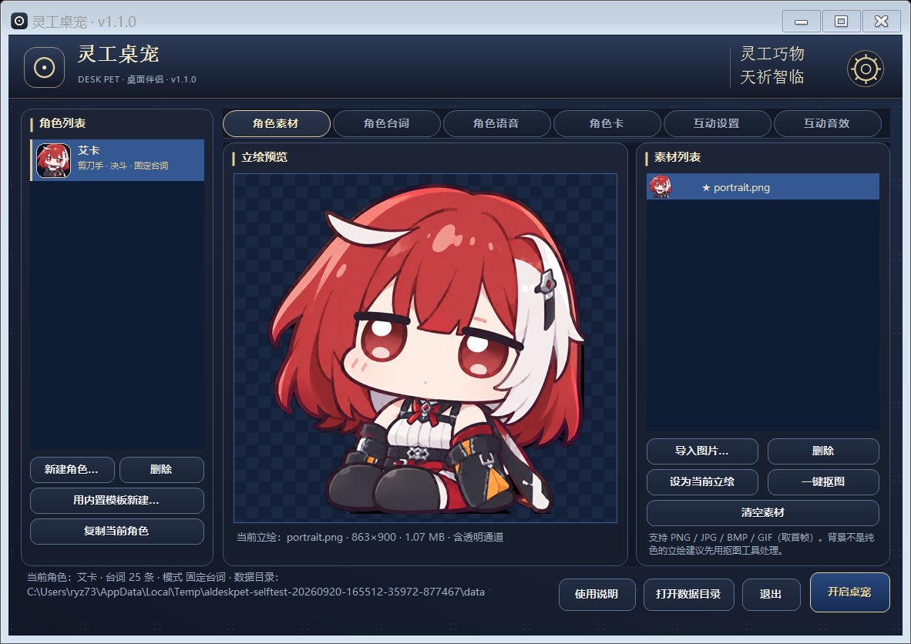
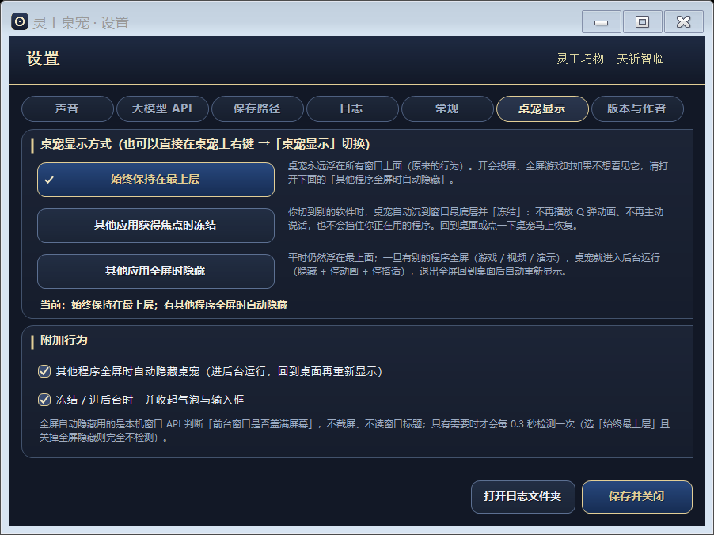

# 灵工桌宠 · Desk Pet（通用版）

> 一个把「会说话的角色」放到 Windows 桌面上的桌面宠物程序。支持多角色、自定义立绘 / 台词 / 语音 / 角色卡、点击随机台词气泡、按压 Q 弹动画，以及**接入大模型**让桌宠真的能和你聊起来。
>
> 作者：**睡不着のHATSUZUKI**（灵工巧物 · 天祈智临）


-5c6bc0?style=flat-square)


---

## 目录

- [它是什么](#它是什么)
- [效果截图](#效果截图)
- [功能一览](#功能一览)
- [快速开始](#快速开始)
- [内置角色（13 位）](#内置角色13-位)
- [使用要点](#使用要点)
- [台词文件语法速查](#台词文件语法速查)
- [目录结构](#目录结构)
- [从源码构建](#从源码构建)
- [测试与验收](#测试与验收)
- [数据 · 隐私 · 安全](#数据--隐私--安全)
- [常见问题](#常见问题)
- [已知限制](#已知限制)
- [版权 · 素材 · 许可](#版权--素材--许可)
- [版本记录](#版本记录)
- [致谢](#致谢)

---

## 它是什么

一个**零第三方依赖**的 Windows 桌面宠物（.NET Framework 4.x + WinForms，用系统自带 `csc.exe` 编译）。装完就能用，不需要额外装运行时、不需要管理员权限、不联网也能跑全部基础功能。

- **桌宠层**：逐像素透明的分层窗口，透明区域点击直接穿透到桌面，不挡鼠标；支持三种显示策略（始终最上层 / 别的程序获得焦点时冻结 / 别的程序全屏时隐藏）。
- **互动层**：点击 Q 弹 + 随机台词气泡；台词可带语音与权重、字号、配色；同一段语音没播完不会换下一句。
- **智能层**：可切到「大模型对话模式」，接 OpenAI 兼容接口（云端 DeepSeek / OpenAI / 中转，或本地 Ollama / LM Studio / OneAPI / llama.cpp），桌宠会结合「你最近在用什么程序」开口搭话 —— 系统监听默认关闭，必须显式授权。
- **素材层**：内置 13 位角色的立绘 / 台词 / 角色卡 / 语音；想换成自己的角色，导入立绘 + 写一份台词文本即可，也可以从内置模板一键新建。

## 效果截图

| 主界面（角色素材页） | 设置 · 桌宠显示 |
|---|---|
|  |  |

| 桌宠在桌面上 | 桌面上的台词气泡 |
|---|---|
|  |  |

> 完整截图（22 张：主界面 6 页 / 设置 7 页 / 桌宠画布 / Q 弹中间帧 / 气泡明暗底）在 [`界面截图/`](界面截图) 目录。

## 功能一览

| 能力 | 说明 |
|---|---|
| 多角色独立 | 立绘 / 台词 / 语音 / 角色卡 / 互动音效**完全独立**，可同时把多个角色放到桌面 |
| 立绘导入 | PNG/JPG/GIF/BMP 均可；自动裁透明边、等比缩放、预乘 alpha 缩放（半透明边缘不发黑） |
| 一键抠图 | 纯色背景洪水填充 + 1px 羽化，原图自动备份；不透明立绘会自动画成「圆角 + 金边 + 投影」卡片 |
| 台词气泡 | 五段分类（问候 / 点击 / 主动 / 待机 / 系统），每条可设**权重、字号、配色、加粗**，可内联语音 |
| 语音清单 | 导入音频后自动生成 `manifest.txt` 清单模板，并给出「已匹配 / 未匹配 / 缺失」统计，避免串词 |
| 角色卡 | 写给大模型的人设说明（≥150 中文字符即可用），支持一键「由角色卡生成台词」 |
| 大模型对话 | 8 个预设地址（DeepSeek / OpenAI / 中转 / Ollama / LM Studio / OneAPI / llama.cpp…），错误按 HTTP 码翻译成人话；回复只在气泡里，不进对话框 |
| 系统事件搭话 | 前台程序名 / 窗口标题 / 键鼠空闲时间 → 生成上下文提示词；30 分钟滚动丢弃、不落盘、默认关闭 |
| 互动音效 | 音效库 + 事件绑定（按下 / 松开 / 弹出 / 收起…），可一键静音 |
| 配置与数据 | 数据目录可迁移；配置**写盘即留备份**，损坏时自动从备份恢复而不是静默重置 |
| 桌宠显示策略 | 始终最上层 / 别的程序获得焦点时冻结 / 别的程序全屏时隐藏；三种模式都有纯函数决策表，零轮询模式空闲 CPU ≈ 0 |
| 卸载安全 | 卸载只删「本产品清单内」的文件；共用目录、目录联接（junction）、无关文件一律保留并写进报告 |
| 关机友好 | 系统关机 / 注销 / 任务管理器结束任务时**直接放行**，不会出现「正在阻止关机」 |

## 快速开始

**系统要求**：Windows 7 / 8 / 8.1 / 10 / 11（x86 或 x64），.NET Framework 4.x（系统自带），无需管理员权限。

**方式一：安装（推荐）**

1. 下载仓库根目录的 [`灵工桌宠-安装程序.exe`](灵工桌宠-安装程序.exe)，或到 **Releases** 页面下载附件
   `LingGongDeskPet-Setup-v1.1.0.exe`（同一个文件，SHA-256 与 `SHA256SUMS.txt` 一致）。
2. 双击运行 → 选择安装目录（默认 `%LOCALAPPDATA%\Programs\AzurLaneDeskPet`）→ 安装完成后可选择立即启动。
3. 第一次启动会自动把 **13 位内置角色**补齐到你的角色列表，直接点「开启桌宠」就能用。
4. 卸载：安装目录里的 `卸载-灵工桌宠.exe`，或「设置 → 应用 → 已安装的应用」。

**方式二：免安装绿色版**

直接运行 [`app/AzurLaneDeskPet.exe`](app/AzurLaneDeskPet.exe)（与安装包内负载逐字节一致），数据仍然写在 `%APPDATA%\AzurLaneDeskPet`。

**校验下载是否完整**：仓库根目录的 [`SHA256SUMS.txt`](SHA256SUMS.txt) 给出安装程序 / 主程序 / 卸载器 / 负载包的 SHA-256：

```powershell
Get-FileHash .\灵工桌宠-安装程序.exe -Algorithm SHA256
```

## 内置角色（13 位）

| id | 角色 | 来源作品 | 立绘 | 台词 | 语音 | 角色卡 |
|---|---|---|---|---|---|---|
| `shinano` | 信浓 | 碧蓝航线 | 2 张 | 45 条 | 16 条 | ✓ |
| `chuyue` | 初月 | 碧蓝航线 | 1 张 | 61 条 | 18 条 | ✓ |
| `prinz_eugen` | 欧根亲王 | 碧蓝航线 | 1 张 | 61 条 | 18 条 | ✓ |
| `shimakaze` | 岛风 | 碧蓝航线 | 1 张 | 61 条 | 18 条 | ✓ |
| `enterprise` | 企业 | 碧蓝航线 | 2 张 | 61 条 | 18 条 | ✓ |
| `michele` | 米雪儿 | 卡拉彼丘 | 1 张 | 28 条 | 2 条 | ✓ |
| `aika` | 艾卡 | 卡拉彼丘 | 1 张 | 25 条 | 2 条 | ✓ |
| `perlica` | 佩丽卡 | 明日方舟：终末地 | 1 张 | 27 条 | 1 条 | ✓ |
| `zhuangfangyi` | 庄方宜 | 明日方舟：终末地 | 1 张 | 27 条 | 1 条 | ✓ |
| `liino` | 梨诺 | 明日方舟：终末地 | 1 张 | 27 条 | — | ✓ |
| `yeshunguang` | 叶瞬光 | 绝区零 | 1 张 | 27 条 | — | ✓ |
| `jufufu` | 橘福福 | 绝区零 | 1 张 | 27 条 | — | ✓ |
| `remielle` | 蕾米埃尔 | 绝区零 | 1 张 | 27 条 | — | ✓ |

- 每位都有五段台词（问候 / 点击 / 主动 / 待机 / 系统），且都包含「你好 / 你终于回来了 / 你怎么不理我」三句。
- 角色卡按公开资料**原创改写**（不使用官方原文），≥320 中文字符；对玩家的称呼按各作官方口径（卡拉彼丘「引航者」、终末地「管理员」、绝区零云岿山「小师弟 / 小师妹」、蕾米埃尔「共犯」）。
- 语音只收录**可公开直链获取**的片段并附 `manifest.txt`；没有语音的角色完全不影响使用，可自行导入音频补齐。
- 素材来源、处理参数与版权归属见 [`docs/素材清单.md`](docs/素材清单.md) 与 [`docs/角色内容说明.md`](docs/角色内容说明.md)。

## 使用要点

**换人**：左侧「角色列表」点一下即换；想同时放多个，选中后「开启桌宠」即可再开一个。

**桌宠显示**（齿轮 → 桌宠显示，或右键桌宠 → 桌宠显示）：

| 模式 | 行为 | 适用 |
|---|---|---|
| 始终保持在最上层 | 永远压在别的窗口上面，但不会抢焦点 | 想一直看到桌宠 |
| 其他应用获得焦点时冻结 | 别的程序到前台就沉到最底下、停动画、不搭话 | 不想被打扰（推荐日常） |
| 其他应用全屏时隐藏 | 全屏（游戏 / 视频）时进后台，回到桌面立刻回来 | 玩游戏、看视频 |

**大模型**：齿轮 → 大模型 API → 选预设（DeepSeek / OpenAI / Ollama…）→ 填地址与 Key → 测试连接。Key 加密后落盘（Windows DPAPI，本机本用户可解密），配置文件里看不到明文。

**系统监听**：齿轮 → 常规 → 勾选授权后，桌宠才知道你在用什么程序；只读程序名 / 窗口标题 / 键鼠空闲时间，30 分钟滚动丢弃、不落盘，随时可撤销。

## 台词文件语法速查

台词文件（`lines\<角色 id>.txt`）用段落标记 + 行内容：

```text
@问候
[10|22|gold|bold] 你终于回来了…我等了你好久。 | v01.mp3
@点击
[6|20|white] 别闹，痒。
@主动
[4|20|rouge] 今天也要一起加油呢。
@待机
[5|20|indigo] 你怎么不理我…
@系统
[3|18|cyan] 开机了呢。
```

- 段标记：`@问候` `@点击` `@主动` `@待机` `@系统`（段内顺序即优先级）。
- 行格式：`[权重|字号|配色|bold] 文本 | 音频文件名`，方括号可省略；`权重` 决定随机抽到的概率，`配色` 支持 `gold / white / rouge / indigo / candy / cyan` 或 `#RRGGBB`。
- 注释：`#` 或 `//` 开头；`|` 后面写音频文件名即可让这句带语音（也能写「含标点 / 精简写法」，匹配时会自动容错）。
- 语音清单：`voices\<角色 id>\manifest.txt`，一行一条 `音频文件 | 对应台词`（或反写），漏写的音频会被忽略、缺文件的条目会被剔除并统计。

## 目录结构

```text
linggong-deskpet\
├─ 灵工桌宠-安装程序.exe          ← 单文件安装程序（可选安装目录，免管理员）
├─ app\                           ← 免安装绿色版（与安装负载逐字节一致）
├─ assets\builtin\                ← 内置素材：characters\（立绘+角色卡+info.json）
│                                    lines\（台词）voices\（语音+清单）
├─ src\                           ← 主程序源码（C# 5 / .NET Framework 4.x）
├─ installer\                     ← 安装器 / 卸载器源码 + payload.zip + 构建与验收脚本
├─ docs\                          ← 详细文档（工程与验收说明 / 素材清单 / 角色内容说明 / 提示词）
├─ 测试报告\                       ← 05 套验收报告原文
├─ 界面截图\                       ← 22 张界面离屏渲染截图
├─ 使用说明.txt / 安装说明（先看这个）.txt
└─ SHA256SUMS.txt                 ← 关键产物哈希
```

## 从源码构建

```powershell
# 1) 编译主程序 + 组装 dist\app + 跑自检（可加 -RenderUi 生成界面截图）
powershell -NoProfile -ExecutionPolicy Bypass -File tools\build.ps1 -RenderUi

# 2) 重新打包安装程序（改了主程序或素材后必须重跑）
powershell -NoProfile -ExecutionPolicy Bypass -File installer\build-setup.ps1

# 3) 验收
powershell -NoProfile -ExecutionPolicy Bypass -File installer\test-installer.ps1
powershell -NoProfile -ExecutionPolicy Bypass -File installer\test-security.ps1
powershell -NoProfile -ExecutionPolicy Bypass -File installer\final-acceptance.ps1
```

- 只需要系统自带的 `csc.exe`（.NET Framework 4.x）与 PowerShell 5.1，**不装任何第三方包**。
- 所有 `.ps1` 都是 **UTF-8 with BOM**（中文 Windows 的 PowerShell 5.1 没有 BOM 会按 ANSI 解码而报语法错），改完记得确认 BOM 还在。
- 验收脚本会把数据目录指向 `%TEMP%` 沙箱，并各自断言「用户真实数据目录未被触碰」，所以复跑不会动你自己的角色与设置。

## 测试与验收

五个套件全部通过（原始报告见 [`测试报告/`](测试报告)）：

| 套件 | 命令 | 结果 |
|---|---|---|
| 主程序自检 · 核心 | `AzurLaneDeskPet.exe --selftest` | **309 / 309**（22 组：目录、JSON、配置抗丢失、角色库、台词解析、语音清单、加权随机、大模型 Mock、系统监听、图片与抠图、排版与动画曲线、音频、内置素材完整性、显示策略…） |
| 主程序自检 · 界面 | `AzurLaneDeskPet.exe --selftest-ui --render-ui=<目录>` | **132 / 132**（气泡复用与语音节流、弹层避让、自适应布局、模式切换、桌宠显示真窗口行为、关机放行、离屏渲染截图） |
| 安装器 / 卸载器验收 | `installer\test-installer.ps1` | **32 / 32** |
| 卸载安全场景 | `installer\test-security.ps1` | **58 / 58**（共用目录 / 目录联接 / 保护不可绕过） |
| 最终成品端到端 | `installer\final-acceptance.ps1` | **103 / 103**（只用安装包：装 → 用 → 自检 → 运行 → 卸 → 清场） |

其中 13 位内置角色逐个断言：五段台词数量与必含句、角色卡字数、**每张立绘 4 项质量断言**（体积 ≤1.2MB / 高度 ≤900 / 四角透明 / **必须是彩色的**）、语音包与清单一套可用。

## 数据 · 隐私 · 安全

- **数据目录**：`%APPDATA%\AzurLaneDeskPet`（角色 / 立绘 / 台词 / 语音 / 音效 / 日志 / `config.json`），可在「设置 → 保存路径」一键迁移。
- **API Key**：落盘前用 Windows DPAPI 加密（`dpapi:v1:` 前缀），只有本机本用户能解；配置里不会出现明文。
- **配置抗丢失**：每次写盘同步留一份 `config.json.bak`；`config.json` 损坏时**从备份恢复**，没有可用备份时标记 `LoadFailed` 而不是静默重置成默认值（损坏文件会被改名留档 `config.json.bad-*`）。
- **系统监听**：默认关闭，必须显式授权；只读前台程序名 / 窗口标题 / 键鼠空闲时间，30 分钟滚动丢弃、不落盘、可随时关闭。
- **卸载**：只删本产品清单内的文件与数据目录中的已知条目；共用文件夹、junction、清单外的文件一律保留并在报告里列出。
- **关机**：收到关机 / 注销 / 任务管理器结束任务的请求立刻放行，先停桌宠再退出，不会卡住关机流程。

## 常见问题

**Q：升级安装会不会把角色和设置弄丢？**
不会。覆盖安装只替换程序文件，数据目录不动；新版还会按模板 id 把**你还没见过的内置角色**补进列表（自己删掉过的不会被复活）。

**Q：装了新版，角色列表里没有新角色？**
启动时会自动补齐并写入标记；若之前手动删过该角色，则按设计不再补回，可在「用内置模板新建」里手动导入。

**Q：语音和台词对不上 / 串词？**
「角色语音」页点「生成 / 更新清单模板」，把音频与文本对应关系补全，再点重新载入；界面会显示匹配与未匹配统计。

**Q：为什么有些角色没有语音？**
只有能公开直链获取的片段才随包附带；其余请自行导入音频（软件对无语音完全兼容）。

**Q：桌宠挡住了别的软件 / 玩游戏时想让它让位？**
齿轮 → 桌宠显示，选「其他应用获得焦点时冻结」或「其他应用全屏时隐藏」。

**Q：关机时提示「桌宠正在阻止关机」？**
v1.0.8 起已修复：系统关机请求直接放行并先停掉桌宠。

## 已知限制

- 只支持 Windows；界面为 WinForms 自绘，无深色模式切换（配色以深蓝 + 金为主）。
- 大模型功能需要自备接口地址与 Key（或本地部署的兼容服务）。
- 内置角色的立绘 / 语音版权归各原作权利方，**仅限本机个人使用，不再分发**（详见下方声明）。
- 更早期版本（v1.0.3 及以前）残留在安装目录、且任何清单都没记录的旧文件，安装器 / 卸载器会按「非本产品文件」保守保留（这正是「不误删」的安全属性）。

## 版权 · 素材 · 许可

- **源代码**：MIT，见 [`LICENSE`](LICENSE)（署名 **睡不着のHATSUZUKI**）。
- **角色立绘 / 语音 / 名称**：版权归各原作权利方所有（碧蓝航线 —— 蛮啾网络 / 悠星网络；卡拉彼丘 —— 上海散爆网络；明日方舟：终末地 —— 鹰角网络；绝区零 —— 米哈游）。这些素材**不在 MIT 许可范围内**，随包附带仅为便于本机个人使用与演示，**请勿二次分发或商用**。
- 台词与角色卡是按公开资料**原创改写**的文本，不复制官方台词原文；语音清单中的音频来源与处理过程逐条记录在 [`docs/素材清单.md`](docs/素材清单.md)。
- 第三方版权与来源汇总见 [`THIRD-PARTY-NOTICES.md`](THIRD-PARTY-NOTICES.md)。

## 版本记录

| 版本 | 内容 |
|---|---|
| **v1.1.0** | 内置角色扩到 **13 位**（新增卡拉彼丘 / 明日方舟：终末地 / 绝区零 共 8 位）；升级按模板 id 补齐新角色；界面改版为圆润简约并去掉作品字样（保留「灵工巧物 / 天祈智临」）；桌面伴侣标识 `DESK PET` |
| v1.0.8 | 修复三处实测问题：欧根亲王立绘被压成灰度（改保色量化）、设置莫名丢失（真因是验收脚本误删用户数据目录，已沙箱化）、关机被阻止（关机请求立即放行） |
| v1.0.7 | 桌宠显示方式可调（始终最上层 / 焦点冻结 / 全屏隐藏），空闲 CPU 从 969ms 降到 31ms（关掉全屏隐藏时为 0ms） |
| v1.0.6 | 创作者标识回归、卸载误删加固复核、API Key 加密复核、重新打包 |
| v1.0.5 | 发布前审核：脱敏、API Key 加密、安装包提位 |
| v1.0.4 | 内置角色扩充 + 卸载安全加固（共用目录 / junction / 保护不可绕过） |
| v1.0.3 及以前 | 角色卡、语音清单、大模型对话、系统监听、Q 弹动画等基础能力 |

更详细的实现要点、需求对照与完整验收记录见 [`docs/工程与验收说明.md`](docs/工程与验收说明.md)。

## 致谢

- 参照 **DSH 小鲸鱼记账挂件** 的核心能力重做（未做任何修改）。
- 资料查证使用萌娘百科、各作官方 wiki / 图鉴与公开社区条目；语音素材来自可公开直链的图鉴站点。
- 感谢每一位提供反馈与实测问题的使用者。
